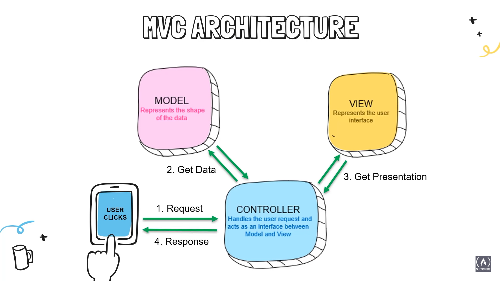

# ASP.Net Core Notes

## General
- .Net Core was initially released in June 2016 as an improved framework on the previous .NET MVC framework (2009) that preceded the Webforms framework(2002).
- Pros:
	- fast and open source compared to previous frameworks
	- cross platform and no longer dependent on windows
	- built in dependency injection. [what is that ??](https://www.freecodecamp.org/news/a-quick-intro-to-dependency-injection-what-it-is-and-when-to-use-it-7578c84fa88f/)
	- new versions easy update and are easy to keep up with
	- cloud friendly (was written with cloud architecture in mind) and compatible with all cloud platforms
	- improved performace compared to previous frameworks


## ASP.Net Core MVC Web App Notes
### .NET Core Pipeline
- .Net Core Pipeline: specifies how an application should respond to requests received.
- Requests received from the browser goes through the pipeline, which is made of different middlewares.
- MVC is a type of middleware itself and can be added to an application by adding the `AddControllersWithViews()` method to the application builder services.
- This adds a number of MVC focused services to the app builder.
- Other middleware include Authentication, Authorization, Routing and Static Files
- The order in which middleware is added to the application pipeline is extremely important as it  dictates how the request will be passed.
- For example, authentication middleware should always come before authorization middleware

### MVC Archictecture
- **Model**: Represents the shape of the data, represented as classes. Corresponds to all the data related logic used in the application.
- **View**: Represents the user interface.
- **Controller**: Handles user requests and interfaces between the model and the view. Process all business logic.


### MVC Web App Features
#### Routes
-  Routes in MVC follows this pattern: `https://localhost:5555(domain)/category(controller)/index(action)/3(id)`
- the id part is optional but controller and action are not. In case those are not provided in a url pattern, the default controllers and actions defined in the program will be used.

#### Tag Helpers
- enables server-side code to participate in creating and rendering HTML elements in [Razor](https://learn.microsoft.com/en-us/aspnet/core/mvc/views/razor?view=aspnetcore-7.0) files.
- pretty much like django template tags

#### Action Result
- the result or return type of an action method/page, e.g. a view, partial view, redirect, json, file, etc.
- a parent class of many of the derived classes that have associated helpers
- `IActionResult` is a generic type that implements all other return types
- but a more specific class like `ViewResult` can be used when a view is specifically being returned
	```c#
	// using the generic IActionResult
	public IActionResult Index()
	{
		return View()
	}

	//using ViewResult
	public ViewResult Index()
	{
		return View()
	}
	```
- `IActionResult` is appropriate when different return types are possible in one action


### Models and Databases
#### Entity Framework
- asp.net uses [entity framework](https://learn.microsoft.com/en-us/ef/) to build database models in applications
- supports LINQ queries, change tracking, updates and schema migrations.

#### Data Annotations
- in asp.net, data annotations(attributes) are used to add context to the kind of fields defined in a model class
- The code snippet below shows a model class with the data annotations `Key` and `Required` added to give context to the 
Id and Name fields
	```C#
	 public class Category
	 {
        [Key]
        // Key data annotation(attribute) sets the Id column as the primary key and identity column
        public int Id { get; set; }
        [Required]
		// sets Name as a required field 
        public int Name { get; set; }
        public int DisplayOrder { get; set; }
        public DateTime CreatedDateTime { get; set; } = DateTime.Now;
        // sets DateTime.Now as default value
	  }
	```

#### DbContext and Unit of Work
- a [dbcontext](https://learn.microsoft.com/en-us/ef/core/dbcontext-configuration/) instance creates a session with a database to track changes, query and save instance of database entities.
- lifetime of a `DbContext` begins when the instance is created and ends when the instance is disposed
- a	`DbContext` instance is designed to be used for a [single unit of work](https://www.martinfowler.com/eaaCatalog/unitOfWork.html)
- > A Unit of Work keeps track of everything you do during a business transaction that can affect the database. When you're done, it figures out everything that needs to be done to alter the database as a result of your work 
- A unit of work using EF Core includes
	- creation of a `DbContext` instance
	- tracking of entity instances by the context *(need to read more on this)*
	- making of changes to tracked entities as needed to implement business rule
	- calling of `SaveChanges` or `SaveChangesAsync` to detect changes made and writing them to the database
	- disposing of instance
- The idea behind using dbcontext to track changes to entities is to avoid writing directly to the database anytime changes are made
- In many web apps, each http request represents a single unit of work, hence makes sense to tie the dbcontext lifetime to that of the request
- In Asp.net, `ApplicationDbContext`, which is a subclass of `DbContext` is created for each request and passed to the controller to 
perform a unit of work before being disposed when the request ends.

- In the code snippet below, the `ApplicationDbContext` class inherits from the base `DbContext` class
Within the constructor of the same name, the options defined in the custom class are passed down to the base `dbcontext` class.
- To create an interface of the database entity `Category` a `DbSet` of the entity named `Categories` is created with getters and setters.
- The `Categories` dbset can now be called in controllers with the application dbcontext to interact with the database.
```c#
	public class ApplicationDbContext : DbContext
	
	{
		public ApplicationDbContext(DbContextOptions<ApplicationDbContext> options) : base (options)
		// DbContextOptions<ApplicationDbContext> is named options and passes down the options defined in the
		// ApplicationDbcontext to the base DbContext class
		{

		}
		public DbSet<Category> Categories { get; set; }
		// this creates a Category table with the name Categories based on the
		// model definition in the Category class

	}

```

#### Migrations
- Migrations help track code changes to data models and implement them to the database
- Process to making migrations
	- in the NuGet package manager console, install the `Microsoft.EntityFrameworkCore.Tools` package to enable migration commands
	- you can then run `add-migration <migration name>` in the package manager console
	- this creates a migration folder with a migration class file that contains `Up` and `Down` methods for upgrading and downgrading 
	database based on changes to the model class
	- use the update-database command to push the migration to the database
	- entity framework core uses the logic in the migration class to generate and insert sql queries into the database to make the necessary
	database changes

#### Connecting to Databases: Process Overview
1. add a database connection string to the `ConnectionStrings` block of the `appsettings.json` file.
	database connection string should contain name of server, database and a trusted_connection boolean
2. congifure the application dbcontext to open a session to the database, track changes and make modifications to the database.
	this is done by creating an `ApplicationDbContext` class which subclasses `DbContext`  with various options.
	the application db context class will hold the names of all the database entities defined using the `DbSet` class
3. add the created application context to the application services using `builder.Services.AddDbContext()` method in the Program.cs file.
	pass the database management system being used as an option to the `AddDbContext()` method along with the connection string created in 
	the `appsettings.json` file.
4. make migrations to the database to create the entities defined in the application


### Controllers and Views
#### Controllers
Controllers handle the application logic and interfaces between the database and the view(user interface).
In an MVC architecture, separate controller classes are usually created to handle related business logic units.
When a Controller class is created, it inherits from the base `Mvc.Controller` class which makes it easy to write controller
logic without writing boilerplate code.
To interface with the database within a controller, we create a reference to the [application dbcontext](#DbContext-and-Unit-of-Work)


### CRUD Operations in Views and Controllers: Process Overview
#### Read
Reading data from a database and rendering it in a view requires using the application dbcontext and controller action to 
interface between the view and the database.
